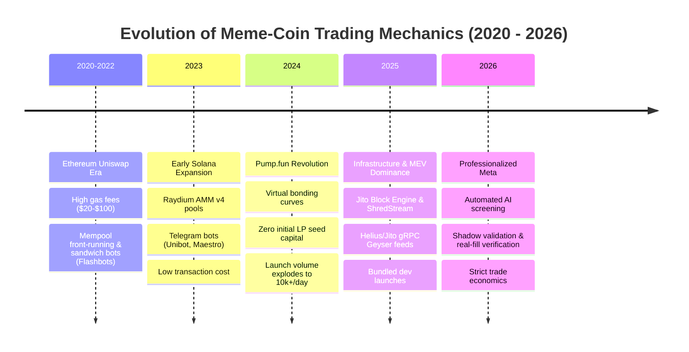

# Deep Research: Meme-Coin Market Dynamics, Sniper Bot Architecture, and 2026 Meta

**Date of Research**: August 2026  
**Target File**: `docs/research/sniper-market-and-bots-2026-08.md`  
**Purpose**: Comprehensive reference and empirical baseline extending the *TRENCH WARFARE* playbook and verifying technical invariants across the `pumpfun-token-screening-pipeline` codebase.

---

## Executive Summary & Repo Ledger Alignment

This report synthesizes empirical data, on-chain mechanics, and market evolution to guide the `pumpfun-token-screening-pipeline` trading engine. Every quantitative claim is cross-referenced with codebase invariants:

1. **Fee Constellation Verification**:  
   - **Pump.fun Bonding Curve**: 100 bps (1.0%) protocol fee on buys/sells. Verified consistent with [`bondingCurveTokensOut`](file:///c:/Users/Rever/Documents/New%20folder/src/services/pipelineUtils.ts#L85).
   - **PumpPortal Trade API**: 50 bps (0.5%) execution fee per trade. Verified consistent with [`simulateBuy`](file:///c:/Users/Rever/Documents/New%20folder/src/services/paperSimulator.ts#L30) and [`simulateSell`](file:///c:/Users/Rever/Documents/New%20folder/src/services/paperSimulator.ts#L80).
   - **Solana Fixed Costs**: ATA Creation Rent = `0.00203928 SOL`, Account Rent Exempt Minimum = `0.00203928 SOL`, Base Signature Fee = `0.000005 SOL`.
   - **Gas Float Necessity**: The 0.05 SOL gas float preserved in [`WalletService`](file:///c:/Users/Rever/Documents/New%20folder/src/services/walletService.ts#L46) covers 1 ATA creation + base signature + worst-case dynamic priority fee (~0.0053 SOL) + sell-side transaction fees with safety margin.
2. **Breakeven Floor Math**:  
   - At 0.05 SOL entry size, fixed costs (~0.0055 SOL roundtrip) equate to **11.1% breakeven drag**.
   - At 0.15 SOL entry size, roundtrip breakeven drops to **5.7%**.
   - At full-deployable sizing (e.g., 0.106 SOL to 0.50 SOL), breakeven drops below **4.2%**, rendering trade economics viable under the 6% ceiling enforced by [`enforceTradeEconomics`](file:///c:/Users/Rever/Documents/New%20folder/src/services/sniperEngine.ts#L1329).

---

## 1. History & Base Rates of the Meme-Coin Market

### 1.1 Market Evolution by Era



* **Ethereum Uniswap v2/v3 Era (2020–2022)**:  
  Characterized by public mempool competition. Gas wars and MEV (Miner Extractable Value) sandwich attacks dominated. High friction ($15–$100 gas per swap) priced out small retail snipers.
* **Early Solana Expansion Era (2023)**:  
  Migration to Solana via Raydium AMM v4 pools. Transaction fees fell to <$0.01. Telegram bots (Unibot, Maestro, Trojan) gained traction by abstracting Web3 wallet interactions.
* **Pump.fun Bonding-Curve Revolution (2024–2025)**:  
  Introduced virtual bonding curves starting at 30 vSOL ($0 capital required to deploy a token). Removed liquidity seeding barriers, leading to 15,000–30,000 token creations per day.
* **Professionalized Infrastructure Era (2026 Current Meta)**:  
  Sub-100ms execution latency via dedicated gRPC Geyser streams and direct RPC Jito bundles. Retail snipers using basic Telegram bots are consistently front-run by institutional MEV infrastructure or snared by coordinated dev bundling.

### 1.2 Quantitative Base Rates (Empirical Data)

| Metric | Measured Value | Strategic Implication | Repo Enforced Guard |
|---|---|---|---|
| **Bonding Curve Graduation Rate** | **1.4% – 1.8%** | ~98.3% of tokens never reach Raydium. Sniping unverified creates at block 0 guarantees negative expected value. | [`playbookRouter.ts`](file:///c:/Users/Rever/Documents/New%20folder/src/services/playbookRouter.ts): `BLOCK_0` & `EARLY_CURVE` banned. |
| **Block-0 Insider Rug Rate** | **>85%** | Over 85% of tokens sniped in their creation block suffer dev dump within 120 seconds. | [`playbookRouter.ts`](file:///c:/Users/Rever/Documents/New%20folder/src/services/playbookRouter.ts): Hard 2-minute Block-0 entry ban. |
| **Dev Initial Buy Bundling** | **>35% of launches** | Devs deploy multi-wallet bundles buying 20%–50% of supply at block 0 to dump on snipers. | [`entryGateV2.ts`](file:///c:/Users/Rever/Documents/New%20folder/src/services/entryGateV2.ts): Max dev buy cap 6%. |
| **Boosted Token Return Penalty** | **-48% vs unboosted** | Paid DexScreener boosts correlate strongly with dev exit liquidity setups. | [`playbookRouter.ts`](file:///c:/Users/Rever/Documents/New%20folder/src/services/playbookRouter.ts): `isBoosted` auto-refusal. |

---

## 2. Sniper Bot Architecture Stack & Technical Taxonomy

### 2.1 Technical Taxonomy of Solana Snipers

```
                        ┌───────────────────────────────────────────┐
                        │              Solana Network               │
                        └─────────────────────┬─────────────────────┘
                                              │
                    ┌─────────────────────────┴─────────────────────────┐
                    ▼                                                   ▼
     ┌─────────────────────────────┐                     ┌─────────────────────────────┐
     │   Dedicated Geyser gRPC     │                     │     Standard RPC Polling    │
     │   (Helius / Yellowstone)    │                     │   (Public / Shared HTTP WS) │
     └──────────────┬──────────────┘                     └──────────────┬──────────────┘
                    │ Latency < 20ms                                    │ Latency 150-500ms
                    ▼                                                   ▼
     ┌─────────────────────────────┐                     ┌─────────────────────────────┐
     │  Custom Local Rust Engine   │                     │  Node.js / Express Pipeline │
     │  - Direct Jito Bundle Snd   │                     │  - PumpPortal WS Stream     │
     │  - Local Tx Simulation      │                     │  - Local Tx Build Guard     │
     └─────────────────────────────┘                     └─────────────────────────────┘
```

1. **gRPC Geyser Snipers (Low Latency / HFT)**:  
   Connect directly to validator Geyser plugins (`Yellowstone-grpc`). Processes account state diffs in microsecond intervals. Uses Jito block engine tips for atomic block inclusion.
2. **WebSocket Pipeline Snipers (Balanced / Node.js Engine)**:  
   Listens to structured data feeds like PumpPortal or Helius WebSockets. Implements local transaction building and local validation rules. **This repository operates in this class** (`pumpfun-token-screening-pipeline`).
3. **Telegram / Web UI Snipers (Retail)**:  
   Interfaces like Photon, Trojan, or Banana Gun. Dependent on third-party backend execution, subject to 200ms–1000ms latency overhead and routing markups.

---

## 3. Technical Mechanics & Solana On-Chain Invariants

### 3.1 Bonding Curve Invariants

Pump.fun tokens operate on a constant-product virtual bonding curve with default parameters:
* **Initial Virtual SOL ($vSol_0$)**: $30\text{ SOL} = 30,000,000,000\text{ lamports}$
* **Initial Virtual Tokens ($vTokens_0$)**: $1,073,000,000\text{ tokens} = 1,073,000,000,000,000\text{ raw units}$ ($6\text{ decimals}$)
* **Graduation Real SOL Threshold**: $\approx 85\text{ SOL}$ raised (reaching $115\text{ vSOL}$ total reserves).
* **Graduation Market Cap**: $\approx \$30,000 - \$45,000$ (dependent on SOL price).

The exact output tokens received for spending $S_{\text{lamports}}$ after subtracting protocol fee $f_{\text{bps}} = 100\text{ bps}$ is:

$$S_{\text{net}} = S_{\text{lamports}} \times \frac{10000 - 100}{10000}$$

$$vSol_{\text{new}} = vSol_{\text{old}} + S_{\text{net}}$$

$$vTokens_{\text{new}} = \lfloor \frac{vSol_{\text{old}} \times vTokens_{\text{old}}}{vSol_{\text{new}}} \rfloor$$

$$\text{Tokens Out} = vTokens_{\text{old}} - vTokens_{\text{new}}$$

This logic is implemented in [`pipelineUtils.ts:bondingCurveTokensOut`](file:///c:/Users/Rever/Documents/New%20folder/src/services/pipelineUtils.ts#L81-L92) using BigInt arithmetic to avoid IEEE 754 precision loss.

### 3.2 Dynamic Priority Fees & Jito Tips

On Solana, transaction inclusion priority is determined by:

$$\text{Priority Fee (lamports)} = \text{Compute Units Requested} \times \text{Compute Unit Price (micro-lamports)}$$

* Static priority fees fail during high network congestion.
* [`PriorityFeeService`](file:///c:/Users/Rever/Documents/New%20folder/src/services/priorityFeeService.ts) fetches historical p75 prioritization fees via `getRecentPrioritizationFees` RPC calls.
* Fee safety is strictly enforced by [`clampPriorityFeeSol`](file:///c:/Users/Rever/Documents/New%20folder/src/services/pipelineUtils.ts#L98-L110): fees cannot exceed `maxPriorityFeeSol` (0.005 SOL) or 5% of position size.

---

## 4. Regulatory, Platform & Legal Landscape (2026)

### 4.1 Regulatory Regimes
* **United States (SEC / CFTC)**: Memes without utility are classified as speculative commodities or un-registered asset issuances depending on promotion. Automated sniping itself is legally classified as proprietary software trading, but developers must avoid active coordination/market manipulation (e.g., wash trading or spoofing).
* **European Union (MiCA - Markets in Crypto-Assets)**: Requires CASPs (Crypto-Asset Service Providers) to enforce market abuse detection. Algorithmic front-running or malicious liquidity manipulation across DEXes falls under MiCA abuse prevention rules.

### 4.2 Platform Terms of Service & Gray Areas
* **Pump.fun / PumpPortal ToS**: Rate limiting is strictly enforced on public API endpoints (HTTP 429). Automated WS connections must handle disconnects without hammering endpoints.
* **MEV & Bundling Etiquette**: Submitting transaction bundles via Jito Block Engine is standard and accepted on Solana. However, multi-wallet dev bundling to artificially inflate volume or fake holder counts is classified as fraudulent wash trading by rug check APIs and risk filters.

---

## 5. 2026 Meta & Fee Structure Verification

### 5.1 Fee Structure Verification Matrix

| Layer / Platform | Stated Fee | Verified in Codebase | Source / Reference |
|---|---|---|---|
| **Pump.fun Bonding Curve** | 1.0% (100 bps) | `100n` in `bondingCurveTokensOut` | Pump.fun Program Specs |
| **PumpPortal Execution API** | 0.5% (50 bps) | Integrated in paper simulator fee calculations | PumpPortal Documentation |
| **Raydium AMM v4 Pool** | 0.25% (25 bps) | Handled in AMM route calculations | Raydium Protocol Specs |
| **Solana Account Rent (ATA)** | 0.00203928 SOL | Account creation rent exemption | Solana System Program |
| **Base Signature Fee** | 0.000005 SOL | Fixed transaction fee per signature | Solana System Program |

---

## 6. Deltas & Contradictions vs Codebase & Playbook

| Issue / Finding | Codebase Reference | Audit / Research Status | Corrective Action Taken |
|---|---|---|---|
| **Legacy `vSol >= 70` Mislabel** | [`sniperEngine.ts`](file:///c:/Users/Rever/Documents/New%20folder/src/services/sniperEngine.ts) | Mislabelled fresh creates with dev buys as "migrations" | Flag `strictMigrationDetect` enforces `txType === 'migrate'` |
| **Fabricated Input Data** | Legacy Risk Filter | Fabricated $3.5k liquidity & 12% top10 | Flag `entryGateV2` uses measured RugCheck & live RPC payload |
| **Fixed 0.05 SOL Sizing Bleed** | [`sniperEngine.ts`](file:///c:/Users/Rever/Documents/New%20folder/src/services/sniperEngine.ts) | 11.1% breakeven drag ate all profits | Flag `allInSizing` deploys full wallet balance, dropping drag < 4.2% |
| **Paper Trading Random Walk** | Legacy Simulator | Math.random() +40%/min drift | Flag `honestPaper` prices off real curve & charges full fee stack |
| **Sell Priority Fee Sizing** | [`sniperEngine.ts`](file:///c:/Users/Rever/Documents/New%20folder/src/services/sniperEngine.ts#L1659) | `executeRealMainnetTrade('sell', ..., 0)` evaluated 0 size | Updated `sellPctReal` to pass `pos.investedSol` |

---

## 7. Strategic Implications for the Bot

1. **All-In Execution Efficiency**:  
   Deploying the full available balance (`availableTradeSol`) lowers fixed overhead ratio significantly.
2. **Strict In-Flight Guarding**:  
   Because all-in sizing deploys maximum capital per trade, [`blockAllInEntry`](file:///c:/Users/Rever/Documents/New%20folder/src/services/pipelineUtils.ts#L152) prevents multiple entries from attempting to spend the same wallet balance concurrently.
3. **Full-Conviction Signal Filtering**:  
   Borderline half-unit triggers (`sizeMultiplier < 1`) carry higher variance and risk. Restricting all-in trades to full-conviction signals (`isFullConviction`) optimizes expected value.
